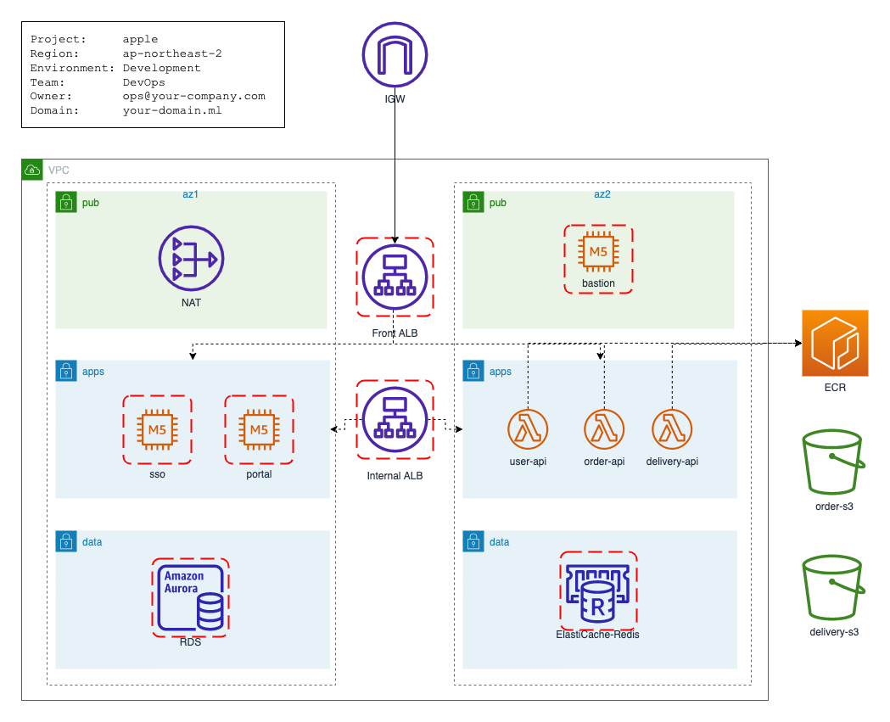

# Project Layout HandsOn



<br>

## 프로젝트 레이아웃 추천 

AWS 클라우드 서비스 구성을 위한 `resources` 와 고객 애플리케이션 서비스를 위한 `services` 디렉토리를 구분 합니다.  
AWS 리소스와 애플리케이션 서비스 각각을 프로비저닝 대상으로 구획화 하여 작업 단위를 분할 합니다.  

```
.
├── resources
│   ├── alb-front
│   │   ├── terraform.tfstate.d
│   │   │   ├── dev
│   │   │   ├── prd
│   │   │   └── stg
│   │   ├── data.tf
│   │   ├── main.tf
│   │   ├── outputs.tf
│   │   ├── providers.tf
│   │   └── variables.tf
│   ├── alb-internal
│   │   ├── terraform.tfstate.d
│   │   │   ├── dev
│   │   │   ├── prd
│   │   │   └── stg
│   │   ├── data.tf
│   │   ├── main.tf
│   │   ├── outputs.tf
│   │   ├── providers.tf
│   │   └── variables.tf
│   ├── ec-redis
│   │   ├── terraform.tfstate.d
│   │   │   ├── dev
│   │   │   ├── prd
│   │   │   └── stg
│   │   ├── data.tf
│   │   ├── main.tf
│   │   ├── outputs.tf
│   │   ├── providers.tf
│   │   └── variables.tf
│   ├── ec2-bastion
│   │   ├── terraform.tfstate.d
│   │   │   ├── dev
│   │   │   ├── prd
│   │   │   └── stg
│   │   ├── data.tf
│   │   ├── main.tf
│   │   ├── outputs.tf
│   │   ├── providers.tf
│   │   └── variables.tf
│   ├── ecr
│   │   ├── terraform.tfstate.d
│   │   │   ├── dev
│   │   │   ├── prd
│   │   │   └── stg
│   │   ├── data.tf
│   │   ├── main.tf
│   │   ├── outputs.tf
│   │   ├── providers.tf
│   │   └── variables.tf
│   ├── rds
│   │   ├── terraform.tfstate.d
│   │   │   ├── dev
│   │   │   ├── prd
│   │   │   └── stg
│   │   ├── data.tf
│   │   ├── main.tf
│   │   ├── outputs.tf
│   │   ├── providers.tf
│   │   └── variables.tf
│   ├── s3
│   │   ├── terraform.tfstate.d
│   │   │   ├── dev
│   │   │   ├── prd
│   │   │   └── stg
│   │   ├── data.tf
│   │   ├── main.tf
│   │   ├── outputs.tf
│   │   ├── providers.tf
│   │   └── variables.tf
│   └── vpc
│       ├── terraform.tfstate.d
│       │   ├── dev
│       │   ├── prd
│       │   └── stg
│       ├── data.tf
│       ├── main.tf
│       ├── outputs.tf
│       ├── providers.tf
│       └── variables.tf
└── services
    ├── delivery-api
    │   ├── terraform.tfstate.d
    │   │   ├── dev
    │   │   ├── prd
    │   │   └── stg
    │   ├── data.tf
    │   ├── main.tf
    │   ├── outputs.tf
    │   ├── providers.tf
    │   └── variables.tf
    ├── order-api
    │   ├── terraform.tfstate.d
    │   │   ├── dev
    │   │   ├── prd
    │   │   └── stg
    │   ├── data.tf
    │   ├── main.tf
    │   ├── outputs.tf
    │   ├── providers.tf
    │   └── variables.tf
    ├── portal
    │   ├── terraform.tfstate.d
    │   │   ├── dev
    │   │   ├── prd
    │   │   └── stg
    │   ├── data.tf
    │   ├── main.tf
    │   ├── outputs.tf
    │   ├── providers.tf
    │   └── variables.tf
    ├── sso
    │   ├── terraform.tfstate.d
    │   │   ├── dev
    │   │   ├── prd
    │   │   └── stg
    │   ├── data.tf
    │   ├── main.tf
    │   ├── outputs.tf
    │   ├── providers.tf
    │   └── variables.tf
    └── user-api
        ├── terraform.tfstate.d
        │   ├── dev
        │   ├── prd
        │   └── stg
        ├── data.tf
        ├── main.tf
        ├── outputs.tf
        ├── providers.tf
        └── variables.tf
```
